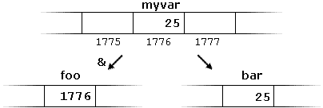

# C++ Primer

## Compound Types



### References

A reference is a type that refers to another type 

```c++
int ival = 1024;
int &refval = ival; // refers to ival
```

A reference is an alias (another name) and is NOT an object

```c++
refval = 2; // assigns 2 to ival
int ii = refval; // equivalent to ii = ival;
int &refval2 = refval; // bounds refval2 to ival
int &refval3 = 10; // error: must initialize to an object
double dval;
int &refval4 = dval // error: must initialize to an object of same type
```

### Pointers

A pointer points to another type

```c++
int *ip1; // integer pointer
int ival = 42;
int *ip2 = &ival; // integer pointer holding the address of ival
double dval;
double *dp1 = &dval; // double pointer holding the address of dval
double *dp2 = dp1; // double pointer
int *ip3 = dp1; // error: bad types
ip3 = &dval; // error: double address can not be assigned to int points

myvar == 25; // true
&myvar == 1776; // true
foo == 1776; // true
*foo == 25; // true
```

## const and constexrp

### General

```c++
const int kVal = 512; //  defines kVal as a constant, trying to change kVal will result in an error
const int kVal2; // error: must initialize a constant
```

### const and references

```c++
const int ci = 1024; // constant integer
const int &r1 = ci; // const reference to to ci
r1 = 512; // error: reference is a constant
int &r2 = c1; // error: non const reference to const object

int i = 256;
const int &r3 = i; // bound to i, but can not be used to change i
```

### const and pointers

```c++
const double pi = 3.14; // constant double
double *ptr = &pi; // error: ptr is a plain pointer
const double *cptr = &pi; // points to pi
*cptr = 42 // error: cptr can not be used to change pi
```

### constexpr

constexpr is constant expression and const itself is constexpr

constexpr is used for variables that are constant

#### constexpr and pointers

```c++
const int *p = nullptr; // p is a pointer to a constint
constexpr int *q = nullptr; // q is a constpointer to int
```


```
